# Graphics
Create graphics with Matlab

  
<h1>Use of graphics in Matlab</h1>
  <!--introduction-->
  

To demonstrate the powerful graphics that can be created with Matlab, I will create a simple figure; a funny character with eyes, mouth and an tongue which resembles a small phagocyte, that is, a white blood cell whose task is to ingest foreign elements that invade multicellular organisms (if you are curious about these cells, the impact in human health and TONS of Matlab code, visit <a href="http://www.phagosight.org">http://www.phagosight.org</a>)
<!--/introduction-->

The first step in many problems is to have a reference, in this case, we will create a coordinate system in X and Y with the function meshgrid like this
<pre class="codeinput">[xx,yy]=meshgrid(1:64,(1:64)');
</pre>

This command creates two matrices, 'xx' and 'yy' which have different orientations and vary from 1 to 64 linearly. We can look at the elements of each matrix like this, first  'xx':
<pre class="codeinput">xx(1:8,1:8)
</pre><pre class="codeoutput">
ans =

     1     2     3     4     5     6     7     8
     1     2     3     4     5     6     7     8
     1     2     3     4     5     6     7     8
     1     2     3     4     5     6     7     8
     1     2     3     4     5     6     7     8
     1     2     3     4     5     6     7     8
     1     2     3     4     5     6     7     8
     1     2     3     4     5     6     7     8

</pre>

Now  'yy':
<pre class="codeinput">yy(1:8,1:8)
</pre><pre class="codeoutput">
ans =

     1     1     1     1     1     1     1     1
     2     2     2     2     2     2     2     2
     3     3     3     3     3     3     3     3
     4     4     4     4     4     4     4     4
     5     5     5     5     5     5     5     5
     6     6     6     6     6     6     6     6
     7     7     7     7     7     7     7     7
     8     8     8     8     8     8     8     8

</pre>

Another way to look at the data is to display it. We can use 'imagesc' to show the data, we can display each matrix separately or we can concatenate it in a single matrix to see both matrices at once:
<pre class="codeinput">imagesc([xx yy])
</pre>

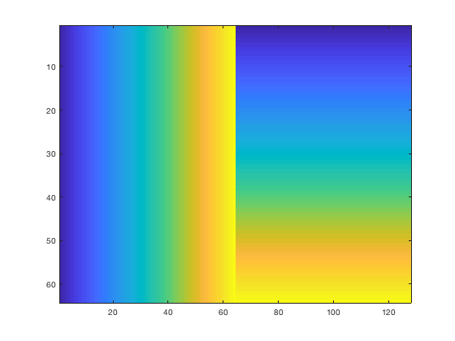

<h2 id="5">Create a sphere
</h2>

With the coordinate reference we can proceed to create the initial figures of our project. First we will create a three-dimensional matrix that will serve as a container for our example:
<pre class="codeinput">data= zeros(64,64,64);
</pre>

The first object that we will create will be a sphere for which we will define a radius:
<pre class="codeinput">radius1= 15;
</pre>

There are several ways to handle the vertical (z) dimension. A simple one is to loop over this dimension for every slice of a volume. To do this we will use a 'for' loop. Then, for every level we will use the value of the level (k) as a parameter to define the data at that particular level. We then use the equation of a sphere to define the values that will increase from the centroid. Later on, we will use thresholds to define surfaces:
<pre class="codeinput">for k=1:64
    data_level      = sqrt((k-33).^2+(xx-33).^2+(yy-33).^2);
    data2_level     = sqrt((k-21).^2+(xx-49).^2+(yy-33).^2);
    data2_level     = 13-data2_level+min(data2_level(:));
    data(:,:,k)     = data_level-data2_level/4;
end
</pre>

We can visualise the data so far by displaying one slice of the data:
<pre class="codeinput">imagesc(data(:,:,23))
</pre>

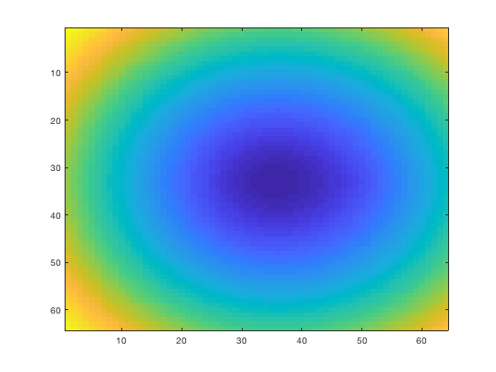

<h2 id="9">Create a mouth
</h2>

Since a plain sphere would be rather boring, we can create what will become a 'mouth' by modifying the values. In this case, we can create a horizontal cylinder that will hollow the sphere:
<pre class="codeinput">mouth= zeros(64,64,64);
for k=1:64
    mouth_level  = sqrt((k-25).^2.1+(xx-45).^2);
    mouth(:,:,k) = (mouth_level);
end
</pre>

Again we can visualise one slice of the data of what will create the mouth:
<pre class="codeinput">imagesc( mouth(:,:,30))
</pre>

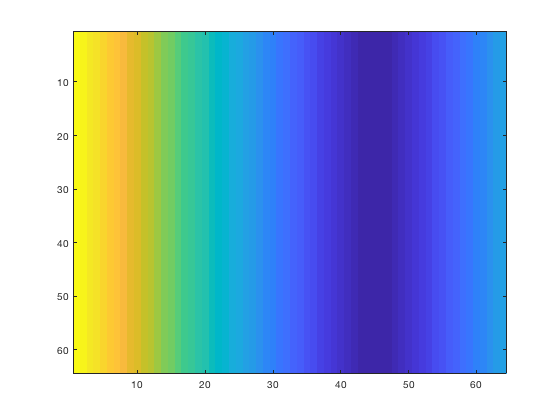

<h2 id="11">Create eyes
</h2>

The eyes will be formed by two smaller spheres. Same procedure, equation of a sphere with different centroids.
<pre class="codeinput">eyes1 = zeros(64,64,64);
eyes2 = zeros(64,64,64);
for k=1:64
    eyes_level1  = sqrt((k-40).^2+(xx-43).^2+(yy-33+8).^2);
    eyes_level2  = sqrt((k-40).^2+(xx-43).^2+(yy-33-8).^2);
    eyes1(:,:,k) = (eyes_level1);
    eyes2(:,:,k) = (eyes_level2);
end
</pre>

Again we can visualise one slice of the data of what will create the eyes:
<pre class="codeinput">imagesc(eyes1(:,:,41))
</pre>

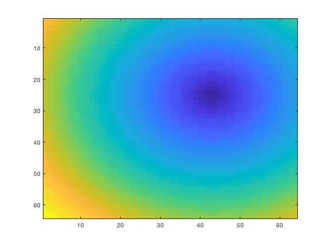

<h2 id="13">Create pupils
</h2>

The pupils are again small spheres:
<pre class="codeinput">pupils1 = zeros(64,64,64);
pupils2 = zeros(64,64,64);
for k=1:64
    pupils_level1  = sqrt((k-40).^2+(xx-45).^2+(yy-33+8.3).^2);
    pupils_level2  = sqrt((k-40).^2+(xx-45).^2+(yy-33-8.3).^2);
    pupils1(:,:,k) = (pupils_level1);
    pupils2(:,:,k) = (pupils_level2);
end
</pre>
<h2 id="14">Create tongue
</h2>

Our figure would not be complete without a tongue! So that is created with the equation of an ellipse:
<pre class="codeinput">tongue= 50*ones(64,64,64);
for k=12:26
    tongue_level  = sqrt((k-21).^2+(xx-40-(9-k/3)).^4+(yy-33).^2);
    tongue(:,:,k) = (tongue_level);
end
</pre>
<h2 id="15">Create figure
</h2>

The data is complete now, however nothing has been displayed. To create our figure we will use two very important commands that are used to create surfaces. The first one is 'isosurface' which finds surfaces around data, and to do this, it finds regions of equal value. You can think of this as the contours that appear in topographical maps which move along positions of constant altitude. The second command is 'patch' that creates the patches that will form the surfaces. Read the help pages of this commands for more information.

Let's now create the figure, first we clear the figure that we last used and display the first surface, which will correspond to the body. Notice how we combine the data of the first sphere and the mouth.
<pre class="codeinput">clf
p1=patch(isosurface(data+29.282*(mouth&lt;6),13));
</pre>

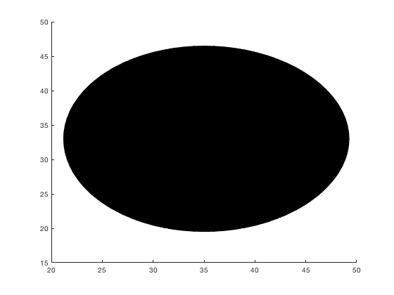

Let's arrange the way that the surface is displayed by changing the colours the lighting. Experiment by adding these commands one by one or changing its values.
<pre class="codeinput">set(p1,'FaceColor','b','EdgeColor','none');
lighting phong
camlight
view(0,0)
</pre>

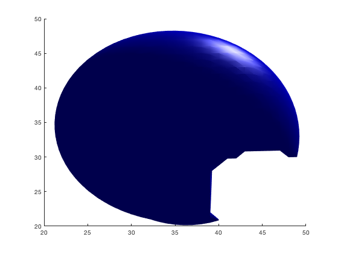

Now let's add all the other elements
<pre class="codeinput">p2=patch(isosurface(eyes1,4.2));
p3=patch(isosurface(eyes2,4.2));
set(p2,'FaceColor','w','EdgeColor','none');
set(p3,'FaceColor','w','EdgeColor','none');
</pre>

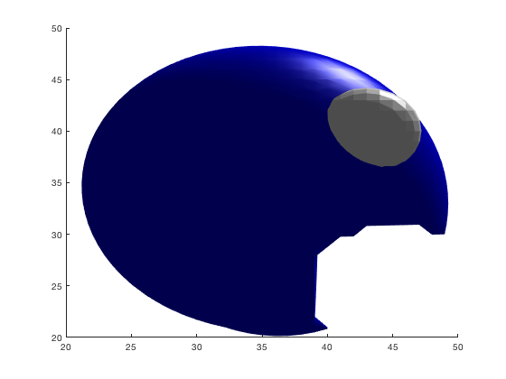
<pre class="codeinput">p4=patch(isosurface(pupils1,3));
p5=patch(isosurface(pupils2,3));
set(p4,'FaceColor','k','EdgeColor','none');
set(p5,'FaceColor','k','EdgeColor','none');
</pre>

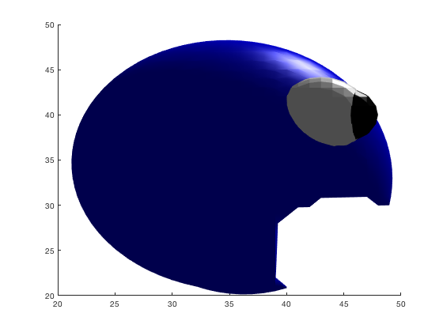
<pre class="codeinput">p6=patch(isosurface(tongue,6));
set(p6,'FaceColor','r','EdgeColor','none');
</pre>

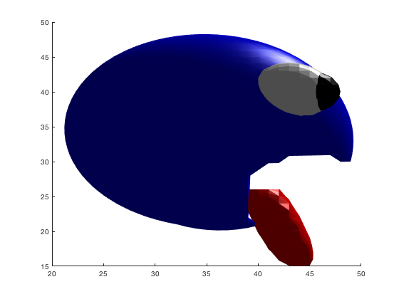
<pre class="codeinput">view(25,12)
camlight left
</pre>

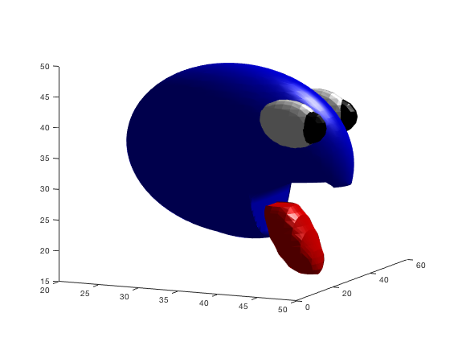

<h2 id="22">Rotate around the figure
</h2><pre class="codeinput">for k=25:10:500
    view(k,12)
    drawnow;
    pause(0.1)
end
</pre>

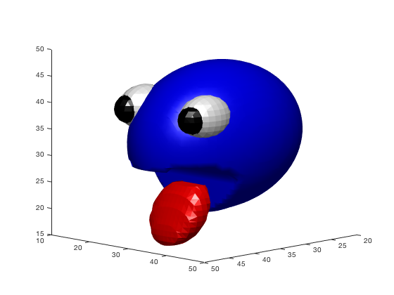

You can now experiment with position, cameras, lights, etc. Open the camera toolbar, under the menu VIEW &gt; CAMERA TOOLBAR. Play with the settings and then create your own graphics!

